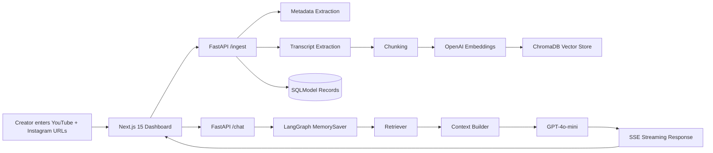

# Creator Video Intelligence RAG Platform

A production-oriented full-stack RAG system for comparing a YouTube video against an Instagram Reel, extracting metadata and transcripts, building embeddings, retrieving evidence, and answering creator-analysis questions with citations and conversational memory.

## What it does

- Validates and ingests one YouTube URL and one Instagram Reel URL.
- Extracts title, creator, views, likes, comments, upload date, duration, hashtags, and follower count.
- Pulls transcripts via `youtube-transcript-api`, then falls back to `yt-dlp` + Whisper where needed.
- Chunks transcripts with `RecursiveCharacterTextSplitter`.
- Embeds chunks with `text-embedding-3-small` and stores them in ChromaDB.
- Answers questions with LangGraph memory and streamed SSE responses.
- Returns citations in the form `Source: Video Name | Chunk N`.
- Compares engagement and hook performance.

## Architecture



## Folder Structure

```text
frontend/
  app/
  components/
  hooks/
  services/
  types/
backend/
  api/
  rag/
  graph/
  vectorstore/
  ingest/
  models/
  utils/
  tests/
docs/
  scaling.md
  loom-demo-script.md
```

## Prerequisites

- Node.js 20+
- Python 3.12+
- OpenAI API key with access to embeddings, chat, and Whisper
- FFmpeg installed for audio fallback flows

## Environment

Copy the sample env files:

- [backend/.env.example](backend/.env.example)
- [frontend/.env.example](frontend/.env.example)

Backend variables:

- `OPENAI_API_KEY`
- `DATABASE_URL`
- `CHROMA_PERSIST_DIR`
- `CORS_ORIGINS`
- `RATE_LIMIT_PER_MINUTE`

Frontend variables:

- `NEXT_PUBLIC_API_BASE_URL`

## Local Setup

### Backend

```bash
cd backend
python -m pip install --upgrade pip
pip install .[dev]
uvicorn backend.api.main:app --reload --port 8000
```

### Frontend

```bash
cd frontend
npm install
npm run dev
```

Open the dashboard at `http://localhost:3000`.

## API Endpoints

- `POST /ingest`
- `POST /chat`
- `GET /metadata`
- `GET /sources`
- `GET /health`

## Deployment Guide

### Docker

```bash
docker compose up --build
```

### Docker Compose, Celery, and Trivy (local)

Prerequisites: Docker Desktop/Engine and Trivy (optional for scanning).

Bring up the full stack (API, frontend, Redis, and Celery worker):

```bash
docker compose up --build -d
```

View logs:

```bash
docker compose logs -f backend
docker compose logs -f worker
```

Run a one-off Celery worker (alternative to the `worker` service):

```bash
docker compose run --rm worker celery -A backend.celery_app worker --loglevel=info
```

Enqueue a task from a Python REPL (example):

```python
from backend.tasks import long_running_ingest
long_running_ingest.delay("https://example.com/video.mp4", {"source":"youtube"})
```

Run Trivy scans locally (optional):

```bash
# Filesystem scan for HIGH/CRITICAL
bash ./scripts/trivy_scan.sh

# Build and scan images (requires Docker)
bash ./scripts/trivy_scan_images.sh
```

To pin base images to digests automatically, a scheduled GitHub Action runs `scripts/pin_base_images.sh` and opens a PR with updates.

Flower monitoring and healthchecks

The compose stack includes a `flower` service on port `5555` for Celery monitoring. Visit `http://localhost:5555` after running `docker compose up`.

Both `backend` and `worker` services include container healthchecks; Docker will report `unhealthy` if the HTTP check or Celery ping fails.

### Vercel Frontend

- Set `NEXT_PUBLIC_API_BASE_URL` to the Railway backend URL.
- Deploy the `frontend/` directory.

### Railway Backend

- Deploy the `backend/` directory using the included `railway.json` and `Dockerfile`.
- Set `OPENAI_API_KEY` and production CORS origins.
- Persist `backend/data` and `backend/data/chroma` if you want long-lived local state.

## Scaling Strategy

The baseline app is designed to work for early-stage usage and can evolve to support roughly 1000 creators/day by introducing:

- Redis caching for repeated metadata and retrieval results.
- Celery or another async worker queue for ingestion and transcription jobs.
- Batched embedding writes to reduce OpenAI API overhead.
- Horizontal scaling of FastAPI workers behind a load balancer.
- A future migration from local Chroma persistence to a managed vector DB such as Qdrant.
- Pre-computed hook analysis and nightly re-indexing for popular creators.

See [docs/scaling.md](docs/scaling.md) for the full plan.

## Cost Analysis

Primary costs come from:

- OpenAI embeddings for chunking and indexing.
- GPT-4o-mini token usage for Q&A.
- Whisper audio transcription for transcript fallback cases.
- Persistent storage for transcripts, chunks, and vector data.

Cost control strategies:

- Chunk transcripts once and reuse embeddings.
- Use retrieval before generation to keep prompts short.
- Cache repeated comparison results.
- Offload ingestion work to background jobs.

## Tradeoffs

- ChromaDB is simple to run and fast to integrate, but managed vector search is better for larger multi-tenant production deployments.
- The current rate limiter is in-process and should be replaced with Redis or gateway enforcement in a distributed setup.
- Whisper fallback improves resilience, but it is more expensive than transcript-first workflows.

## Future Improvements

- Add background job orchestration for ingestion.
- Add user auth and workspace isolation.
- Persist conversation summaries for long-lived memory.
- Add admin observability dashboards and tracing.
- Move to Qdrant or another managed vector store at scale.
- Add richer hook scoring with a dedicated analysis model.

See [docs/scaling.md](docs/scaling.md) for the full plan.

## Verify CI Locally (dry run)

You can run GitHub Actions workflows locally with `act` for a dry run. This requires Docker and `act` installed.

Install `act`:

```bash
# macOS (homebrew)
brew install act

# Linux (download release):
# https://github.com/nektos/act#installation
```

Run the `compose-healthcheck` workflow locally:

```bash
# Run the workflow job named 'compose-up' (uses docker runner)
act -j compose-up --container-architecture linux/amd64
```

Notes:

Database migrations (Alembic)
-----------------------------

This project includes Alembic scaffolding in `backend/alembic/`. To generate and apply migrations locally:

```bash
# Install backend dependencies (including alembic)
cd backend
pip install -e .[dev]

# Generate a new migration (autogenerate requires models to be importable from backend.models)
alembic -c alembic.ini revision --autogenerate -m "create initial tables"

# Apply migrations (ensure DATABASE_URL is set to your DB)
alembic -c alembic.ini upgrade head
```

In production, set `DATABASE_URL` to a managed Postgres instance and run migrations during your deploy pipeline.

